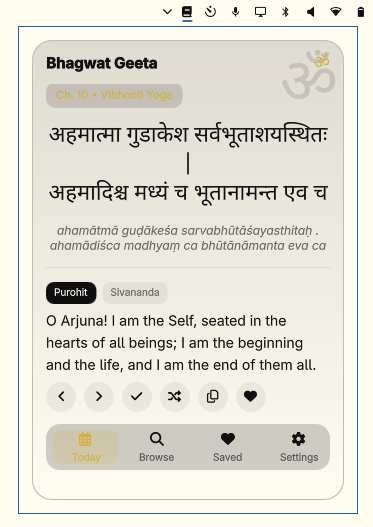
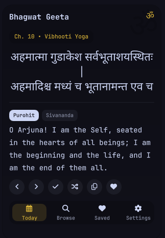
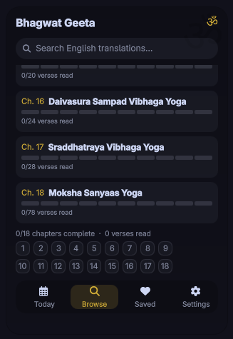
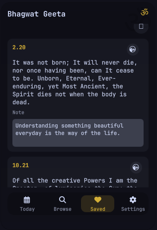

# bhagwat geeta

a gita verse in your omarchy bar. that's it.



## what it does

- bar shows the verse of the day - gold when unread, normal when read
- click opens the popup: today, browse, saved, settings
- right-click: random verse · middle-click: copy · scroll: prev/next
- browse all 18 chapters with progress + a chapter countdown chart
- save favourites with notes, mark verses read, streak + totals
- 701 verses offline, purohit + sivananda translations

| <br>today | <br>browse |
| <br>saved | <br>settings |

## install

```bash
omarchy plugin add https://github.com/paudelsamir/bhagwat-geeta --enable
```

needs `wl-clipboard` for copy (already on omarchy).

## remove

```bash
omarchy plugin disable paudelsamir.bhagwat-geeta
omarchy plugin remove paudelsamir.bhagwat-geeta
rm -rf ~/.config/omarchy/geeta-bar  # favourites, notes, streak
```

> [!NOTE]
> verses come from the vedicscriptures bhagavad-gita-api (MIT), translations by shri purohit swami + swami sivananda. rebuild with `tools/build-data.sh`, check with `python3 tools/ui-audit.py`.
>
> settings live in the bar entry in `~/.config/omarchy/shell.json` - `omarchy bar set paudelsamir.bhagwat-geeta <key> <value>`.
>
> state (favourites, notes, reads) lives in `~/.config/omarchy/geeta-bar/settings.json`.
>
> after editing plugin files: `omarchy-shell shell rescanPlugins`. if it acts stale, `omarchy restart shell`.
